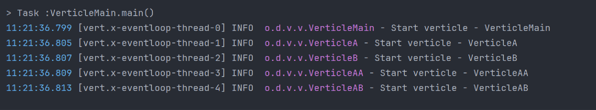
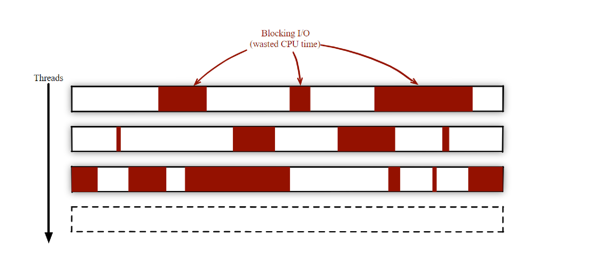
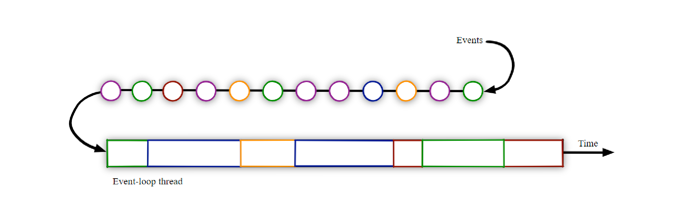
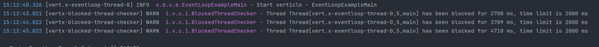
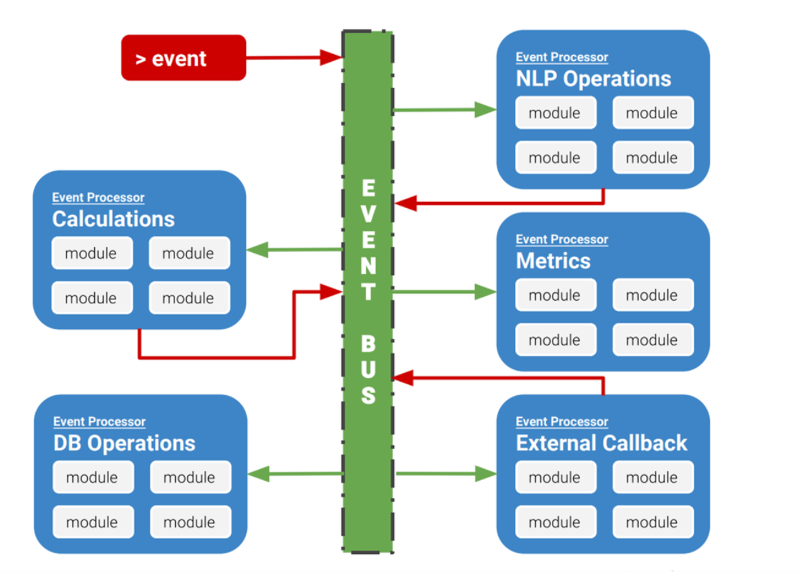

= Vertex-starter

image:https://img.shields.io/badge/vert.x-4.5.0-purple.svg[link="https://vertx.io"]

== Основные понятия

*1. Vert.x Object* - основной объект Vertx, ядро всей системы (центр управления),
с его помощью создаются серверы, клиенты взаимодействия с шиной событий и т.д.
link:src/main/java/org/dshid/vertex_starter/MainVerticle.java[_MainVerticle_]

*2. Vert.x Verticles* - модель развертывания и параллелизма в мире Vert.x.
Обычно приложение состоит из нескольких вертиклей (фрагмент кода),
каждый из которых выполняется в своем потоке (для неблокирующих операция в event loop thread),
и обменивается сообщениями с другими через шину событий (event bus).

link:src/main/java/org/dshid/vertex_starter/verticles[В качестве примера] есть основной verticle который развертывает дочерние и т.д.
При запуске link:src/main/java/org/dshid/vertex_starter/verticles/VerticleExampleMain.java[_VerticleExampleMain_] можно увидеть
разворачивание verticles от родительского к дочерним в своих потоках (event-loop-thread)

.Лог запуска вертиклов


link:src/main/java/org/dshid/vertex_starter/scaling[_Примеры скалирования вертиклов_]

*3. Event Loop Threads* - по умолчанию код вертиклов выполняется в неблокирующем цикле событий.
Можно представить в виде очереди из ивентов, которые выполняются ассинхронно,
минимизируя время простоя ЦПУ которое наблюдается при работе с блокирующими операциями

.Многопоточная работы с блокирующими операциями


.Неблокирующий цикл событий


Eсть операции, которые блокируются по своей природе, например, традиционный доступ к реляционной базе данных.
доступ к файлам или просто ожидание ответов сети,
поскольку операций блокировки избежать невозможно. Подобные события можно выполнять в так называемых рабочих потоках _Worker Thread_.

Кроме того, Vertex имеет встроенную программу проверки блокировки потоков, которая предупреждает, когда цикл событий блокируется.

Выглядит это

.Лог срабатывания проверки блокировок


link:src/main/java/org/dshid/vertex_starter/eventloops[_Примеры с коментариями_]

* https://vertx.io/introduction-to-vertx-and-reactive[более подробная информация тут]

*4. Worker Threads* - потоки для выполнения блокирующих операций.
Несколько вариант работы с блокирующими вызовами, либо внутри вертикла выполняем внутри worker threads
, либо целиком вертикл помещаем работать в worker thread.

link:src/main/java/org/dshid/vertex_starter/worker[_Примеры с коментариями_]

*5. Event Bus* - шина событий, используется для взаимодействия между вертиклами(каждый из которых выполняется в своем потоке).
Шина обеспечивает управляемую событиями связь неблокирующим потокобезопасным способом, и существует в единственном экземпляре(нечто вроде нервной системы vert.x)

.Шина событий

Шина событий поддерживает три способа обмена сообщениями:

* Первый — это публикация сообщений о подписке. link:src/main/java/org/dshid/vertex_starter/eventbus/PublishSubscribeExample.java[_Publish / subscribe messages_]
* Второй обмен сообщениями «point to point». link:src/main/java/org/dshid/vertex_starter/eventbus/PointToPointExample.java[_Point-to-point messaging_]
* Третий обмен сообщениями с запросом ответа. link:src/main/java/org/dshid/vertex_starter/eventbus/RequestResponseExample.java[_Request-response messaging_]

link:src/main/java/org/dshid/vertex_starter/eventbus[_Примеры с коментариями_]

* https://blog.knoldus.com/event-bus-in-vert-x-how-it-works[более подробная информация тут]

*6. Future and Promise*

*_Promise_* - используется для записи конечного значения и может быть выполнено или помечено как невыполненное.

*_Future_* - используется для чтения значения из обещания, когда оно доступно.

link:src/test/java/org/dshid/vertex_starter/TestFuturePromiseExample.java[_Демонстрация_]


//
// This application was generated using http://start.vertx.io
//
// == Building
//
// To launch your tests:
// ```
// ./gradlew clean test
// ```
//
// To package your application:
// ```
// ./gradlew clean assemble
// ```
//
// To run your application:
// ```
// ./gradlew clean run
// ```

== Help

* https://vertx.io/docs/[Vert.x Documentation]
* https://www.baeldung.com/vertx[Baeldung Vert.x]
* https://stackoverflow.com/questions/tagged/vert.x?sort=newest&pageSize=15[Vert.x Stack Overflow]


